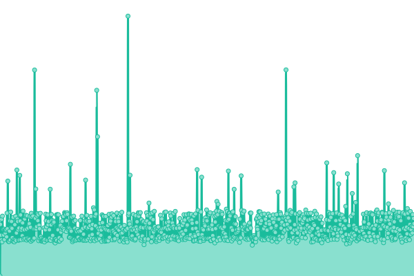
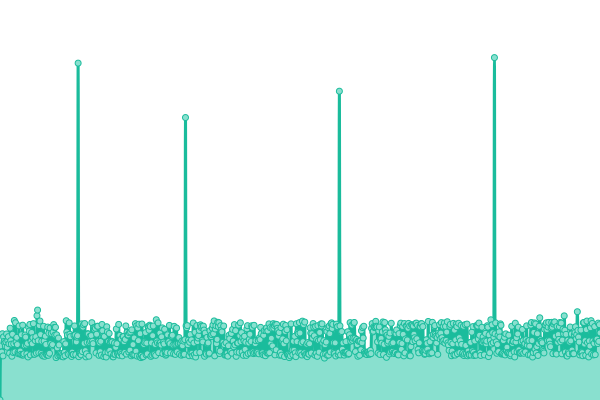
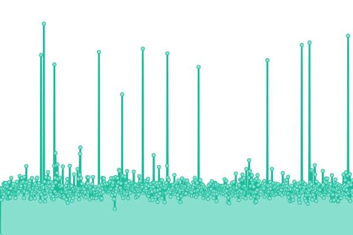
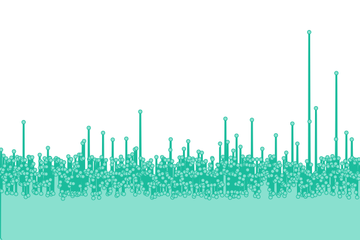
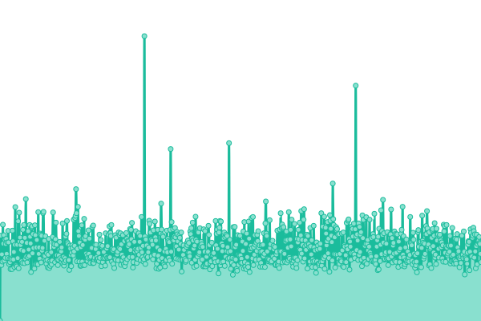

# [📈 Live Status](https://shirfan.github.io/Uptime): <!--live status--> **🟩 All systems operational**

This repository contains the open-source uptime monitor and status page for [Irfan Durmus](http://irfandurmus.com/cv), powered by [Upptime](https://github.com/upptime/upptime).

With [Upptime](https://upptime.js.org), you can get your own unlimited and free uptime monitor and status page, powered entirely by a GitHub repository. We use [Issues](https://github.com/Irfan/upptime/issues) as incident reports, [Actions](https://github.com/Irfan/upptime/actions) as uptime monitors, and [Pages](https://Irfan.github.io/upptime) for the status page.

<!--start: status pages-->
<!-- This summary is generated by Upptime (https://github.com/upptime/upptime) -->
<!-- Do not edit this manually, your changes will be overwritten -->
<!-- prettier-ignore -->
| URL | Status | History | Response Time | Uptime |
| --- | ------ | ------- | ------------- | ------ |
|  [ilger.com](https://www.ilger.com) | 🟩 Up | [ilger-com.yml](https://github.com/shirfan/Uptime/commits/HEAD/history/ilger-com.yml) | 

 1429ms
     
 | 

<a href="https://shirfan.github.io/Uptime/history/ilger-com">100.00%</a>
    

|  KOS Site | 🟩 Up | [kos-site.yml](https://github.com/shirfan/Uptime/commits/HEAD/history/kos-site.yml) | 

 898ms
     
 | 

<a href="https://shirfan.github.io/Uptime/history/kos-site">46.07%</a>
    

|  [KOS 02](https://kos02.ilger.com) | 🟩 Up | [kos-02.yml](https://github.com/shirfan/Uptime/commits/HEAD/history/kos-02.yml) | 

 895ms
     
 | 

<a href="https://shirfan.github.io/Uptime/history/kos-02">46.08%</a>
    

|  [smtp2.ilger.com](smtp2.ilger.it) | 🟩 Up | [smtp2-ilger-com.yml](https://github.com/shirfan/Uptime/commits/HEAD/history/smtp2-ilger-com.yml) | 

 288ms
     
 | 

<a href="https://shirfan.github.io/Uptime/history/smtp2-ilger-com">100.00%</a>
    

|  [test site](https://ilger.com/) | 🟩 Up | [test-site.yml](https://github.com/shirfan/Uptime/commits/HEAD/history/test-site.yml) | 

 1937ms
     
 | 

<a href="https://shirfan.github.io/Uptime/history/test-site">100.00%</a>
    

|  [vps.qweb.eu](vps.qweb.eu) | 🟩 Up | [vps-qweb-eu.yml](https://github.com/shirfan/Uptime/commits/HEAD/history/vps-qweb-eu.yml) | 

 287ms
     
 | 

<a href="https://shirfan.github.io/Uptime/history/vps-qweb-eu">100.00%</a>
    

<!--end: status pages-->

[**Visit our status website →**](https://shirfan.github.io/Uptime)

## 📄 License

- Powered by: [Upptime](https://github.com/upptime/upptime)
- Code: [MIT](./LICENSE) © [Irfan Durmus](http://irfandurmus.com/cv)
- Data in the `./history` directory: [Open Database License](https://opendatacommons.org/licenses/odbl/1-0/)
